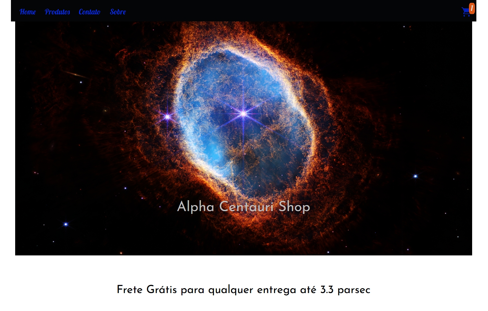

# AlphaCentauriShop
<h2>Python Flask Shooping Cart</h2>

<h3> Carrinho de compras com BackEnd <b> Python </b> usando <b> Flask </b> </h3>
  
  <h4>
  <ul> 
    <li> <b> Python </b> com <b> Flask </b> e <b> Jinja </b> </li>
    <li> <b> Banco de dados </b> (Biblioteca: <b> sqlite3 </b>) </li>
    <li> <b> Javascript </b> no FrontEnd </li>
    <li> <b> CSS </b> com <b> BootStrap </b> </li>
  </ul>
  </h4>
  
   Executar: <b>python alphaCentauri.py</b> para subir o servidor, e deixar rodando

  
  
 TODO: Subir o site funcionando na plataforma AWS da Amazon 

Imagem da Home

